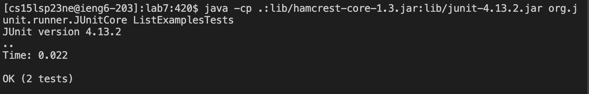
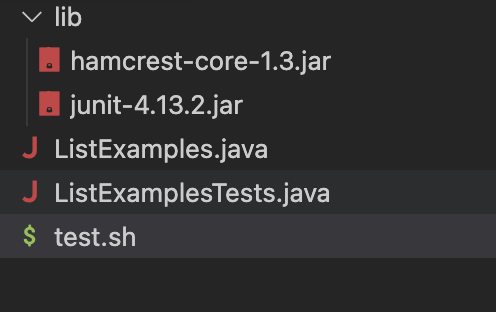
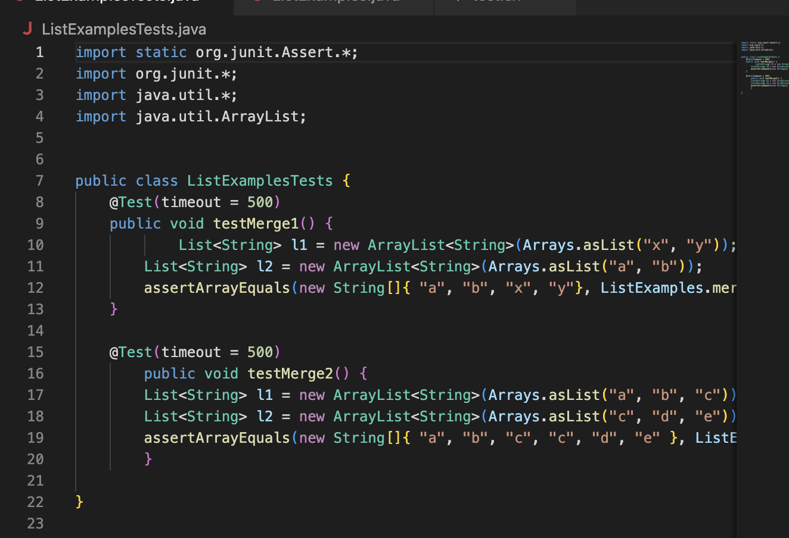
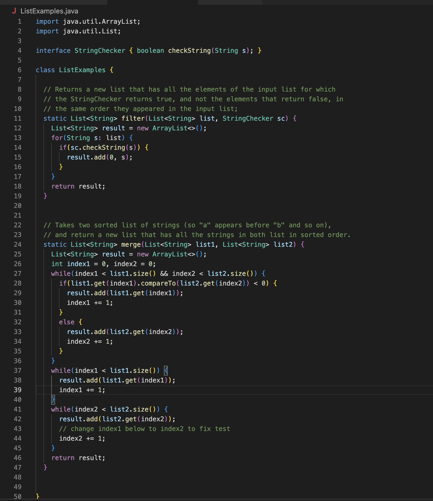

## Part 1 – Debugging Scenario
1. a) The environment I'm using:                                                                                    
      Computer: MacBook Pro. 
      Operating system: macOS. 
      Web browser: Google.
      Terminal: In macOS, it is still called Terminal. 
      Editor: Visual Studio Code.
      
   b) The detail symptom I'm seeing: Here is what I expected to see: 
      ```
      JUnit version 4.13.2
      ..
     Time: 0.022
      
     OK (2 tests)
     ```
     Here is what I'm seeing: 
     ```
     JUnit version 4.13.2
     .E
    Time: 0.002
    There was 1 failure:
    1) initializationError(org.junit.runner.JUnitCommandLineParseResult)
    java.lang.IllegalArgumentException: Could not find class [ListExamplesTests.java]
        at org.junit.runner.JUnitCommandLineParseResult.parseParameters(JUnitCommandLineParseResult.java:100)
        at org.junit.runner.JUnitCommandLineParseResult.parseArgs(JUnitCommandLineParseResult.java:50)
        at org.junit.runner.JUnitCommandLineParseResult.parse(JUnitCommandLineParseResult.java:44)
        at org.junit.runner.JUnitCore.runMain(JUnitCore.java:72)
        at org.junit.runner.JUnitCore.main(JUnitCore.java:36)
    Caused by: java.lang.ClassNotFoundException: ListExamplesTests.java
        at java.base/jdk.internal.loader.BuiltinClassLoader.loadClass(BuiltinClassLoader.java:641)
        at java.base/jdk.internal.loader.ClassLoaders$AppClassLoader.loadClass(ClassLoaders.java:188)
        at java.base/java.lang.ClassLoader.loadClass(ClassLoader.java:521)
        at java.base/java.lang.Class.forName0(Native Method)
        at java.base/java.lang.Class.forName(Class.java:495)
        at java.base/java.lang.Class.forName(Class.java:474)
        at org.junit.internal.Classes.getClass(Classes.java:42)
        at org.junit.internal.Classes.getClass(Classes.java:27)
        at org.junit.runner.JUnitCommandLineParseResult.parseParameters(JUnitCommandLineParseResult.java:98)
        ... 4 more

    FAILURES!!!
    Tests run: 1,  Failures: 1
    ```
    c) Detail the failure-inducing input and context: The command I run in the terminal: 
      ```java -cp .:lib/hamcrest-core-1.3.jar:lib/junit-4.13.2.jar org.junit.runner.JUnitCore ListExamplesTests.java```.
                                                                                              
2-1. A response from a TA asking a leading question or suggesting a command to try:
        Try to describe how to change the commands or program to get the expected output, there might be some useful things in the test.sh. 
                                                                                              
2-2. Here is the screenshot showing what information the student got from trying that: 
     
     Here is a clear description of what the bug is: For the second command in the terminal, it should be 
     ```java -cp .:lib/hamcrest-core-1.3.jar:lib/junit-4.13.2.jar org.junit.runner.JUnitCore ListExamplesTests```, which compare to the wrong                one, delete ```.java``` after the ```ListExamplesTests```.                                  
     
2-3. The file & directory structure needed: ListExamples.java, ListExamplesTests.java. test.sh, and the lib includes hamcrest-core-1.3.jar and junit-        4.13.2.jar.                                                                      
                                                                
     The contents of each file before fixing the bug: 
     
                                    
     The full command line (or lines) you ran to trigger the bug: 
     ```
     javac -cp .:lib/hamcrest-core-1.3.jar:lib/junit-4.13.2.jar *.java
     java -cp .:lib/hamcrest-core-1.3.jar:lib/junit-4.13.2.jar org.junit.runner.JUnitCore ListExamplesTests.java
     ```                                                               
     A description of what to edit to fix the bug: To run it successfully, the second command should have ```ListExamplesTests``` instead of                  ```ListExamplesTests.java```. More specifically,                                              
     ```
     java -cp .:lib/hamcrest-core-1.3.jar:lib/junit-4.13.2.jar org.junit.runner.JUnitCore ListExamplesTests
     ```.   
                                                                             
## Part 2 – Reflection
The cool thing I learned from the lab is that we can edit the code and search the require file all through the command line from the terminal. For example, in week 7 lab, after I made a fork of a folder, log in to my ieng6 account through the terminal, and clone my fork of the repository from Github account. I can simply type ```vim ListExamples.java``` to enter and edit the code through the termianl, which is amazing. Also, I found some
Vim commands to make the edit process easier, such that, ```x``` can delete current character, and ```X``` can delete previous character. Moreover, I also found out some interesting commands that help search different kinds of files through the terminal, which are: ```grep -c```, ```grep -r```, ```grep -o```, and ```grep -n```. ```grep -c``` can use to count print only a count of matching lines per file, ```grep -r``` is use to recurse, ```grep - o``` is use to matching show only the part of a line matching patterns, as for ```grep -n```, it is use to print line number with output lines. They are all useful commands. 
